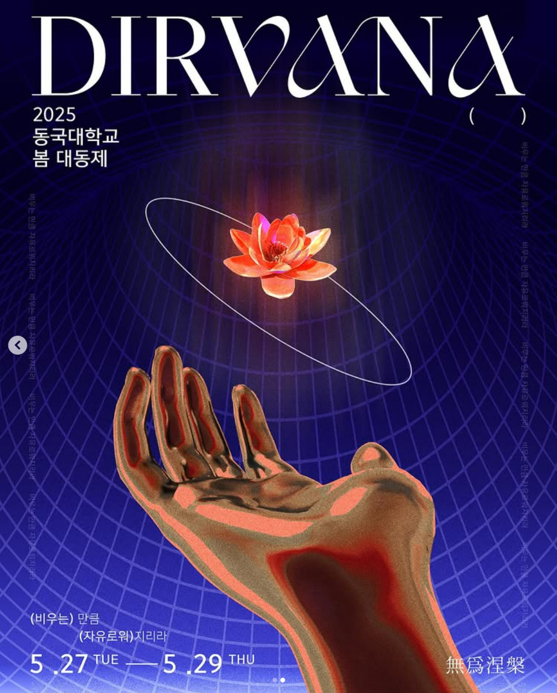
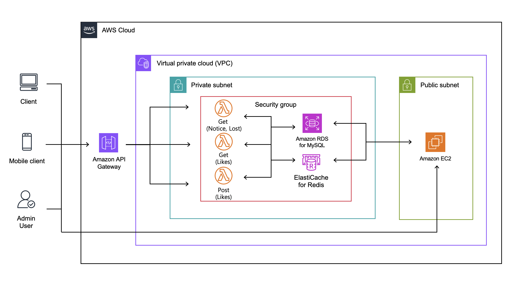

# DGU-2025-Festival-BE
2025 Dongguk Festival Dirvana Backend Server

## Backend Server Member

 
<table align="center">
  <tr align="center">
    <td>Auth / FCM / Reserve</td>
    <td>Lambda Query / Cache / Rank</td>
    <td>Monitoring / Reserve</td>
    <td>Command Query</td>
  </tr>
  <tr align="center">
    <td></td>
    <td></td>
    <td></td>
    <td></td>
  </tr>
  <tr align="center">
    <td><a href="https://github.com/leejs0823">MINGI PARK</a></td>
    <td><a href="https://github.com/5hseok">HYEONSEOK OH</a></td>
    <td><a href="https://github.com/bk123477">SUNGWOO AN</a></td>
    <td><a href="https://github.com/Newooon">UHYUN JUNG</a></td>
  </tr>
</table>
 

## 기술 스택
- Spring Boot 3.4.5
- Spring Security
- JPA/Hibernate
- Redis (Amazon Elasticache Valkey)
- MySQL 8.0.40 (Amazon RDS)
- AWS S3
- AWS EC2
- Firebase FCM

- Python 3.11 (with AWS Lambda)
- AWS Lambda & Amazon API Gateway (use for Lost and Notice Query)

## Architecture Diagram

### More Info
[More Info for DeepWiki](https://deepwiki.com/5hseok/DGU-2025-Festival-BE)